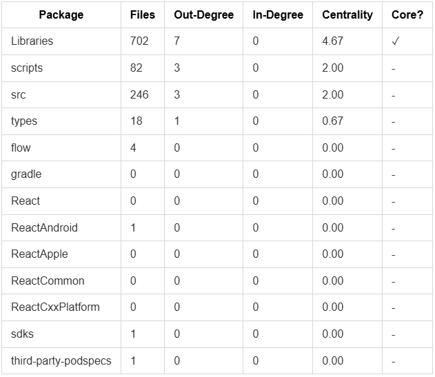

# React Native Packages - Dependency Analysis Report

**Generated:** 2026-05-14T20:43:30.826Z

---

## Executive Summary

This report analyzes **code-level dependencies** and **knowledge dependencies** (co-change patterns) across 13 packages in the React Native monorepo.

### Key Findings

- **Total Packages:** 13
- **Total Internal Dependencies:** 14
- **Inconsistencies Found:** 353
- **Core Packages (high centrality):** Libraries

---

## Section 1: Code Dependencies Analysis

### 1.1 Dependency Metrics Summary




### 1.2 Packages with Most Dependencies (Out-Degree)

These packages import heavily from other packages:


**Libraries** (7 dependencies)
- Files: 702
- Imports from: fantom, react-native, jest-preset/jest/renderer, assets-registry/path-support, assets-registry/registry, virtualized-lists, normalize-colors

**scripts** (3 dependencies)
- Files: 82
- Imports from: community-cli-plugin, codegen/lib/generators/RNCodegen.js, codegen/lib/cli/combine/combine-js-to-schema.js

**src** (3 dependencies)
- Files: 246
- Imports from: jest-preset/jest/renderer, fantom, react-native

**types** (1 dependencies)
- Files: 18
- Imports from: react-native

**flow** (0 dependencies)
- Files: 4
- Imports from: 

**gradle** (0 dependencies)
- Files: 0
- Imports from: 

**React** (0 dependencies)
- Files: 0
- Imports from: 

**ReactAndroid** (0 dependencies)
- Files: 1
- Imports from: 

**ReactApple** (0 dependencies)
- Files: 0
- Imports from: 

**ReactCommon** (0 dependencies)
- Files: 0
- Imports from: 


### 1.3 Packages with Most Dependents (In-Degree)

These packages are most relied upon by others:


**Libraries** (0 dependents)
- Used by: 

**scripts** (0 dependents)
- Used by: 

**src** (0 dependents)
- Used by: 

**types** (0 dependents)
- Used by: 

**flow** (0 dependents)
- Used by: 

**gradle** (0 dependents)
- Used by: 

**React** (0 dependents)
- Used by: 

**ReactAndroid** (0 dependents)
- Used by: 

**ReactApple** (0 dependents)
- Used by: 

**ReactCommon** (0 dependents)
- Used by: 


### 1.4 Packages with Least Dependencies (Leaf Packages)

These packages have minimal dependencies on others (good for testing/modularity):

- **flow** (4 files, 0 deps, 0 dependents)
- **gradle** (0 files, 0 deps, 0 dependents)
- **React** (0 files, 0 deps, 0 dependents)
- **ReactAndroid** (1 files, 0 deps, 0 dependents)
- **ReactApple** (0 files, 0 deps, 0 dependents)
- **ReactCommon** (0 files, 0 deps, 0 dependents)
- **ReactCxxPlatform** (0 files, 0 deps, 0 dependents)
- **sdks** (1 files, 0 deps, 0 dependents)
- **third-party-podspecs** (1 files, 0 deps, 0 dependents)
- **types** (18 files, 1 deps, 0 dependents)


---

## Section 2: Dependency Graph Analysis

### 2.1 Internal Dependency Relationships


**types**
- Out-degree: 1 → Imports: react-native
- In-degree: 0 → Imported by: none

**scripts**
- Out-degree: 3 → Imports: community-cli-plugin, codegen/lib/generators/RNCodegen.js, codegen/lib/cli/combine/combine-js-to-schema.js
- In-degree: 0 → Imported by: none

**src**
- Out-degree: 3 → Imports: jest-preset/jest/renderer, fantom, react-native
- In-degree: 0 → Imported by: none

**Libraries**
- Out-degree: 7 → Imports: fantom, react-native, jest-preset/jest/renderer, assets-registry/path-support, assets-registry/registry, virtualized-lists, normalize-colors
- In-degree: 0 → Imported by: none


---

## Section 3: Knowledge Dependencies (Co-Change Analysis)

Co-change patterns show which files are frequently modified together, indicating logical or functional coupling:

### 3.1 Most Frequent Co-Changes

- **react-native** ↔ **rn-tester**: 216 commits [Code Dep: ✗]
- **react-native** ↔ **react-native-codegen**: 67 commits [Code Dep: ✗]
- **react-native** ↔ **virtualized-lists**: 66 commits [Code Dep: ✗]
- **react-native** ↔ **react-native-fantom**: 56 commits [Code Dep: ✗]
- **rn-tester** ↔ **virtualized-lists**: 44 commits [Code Dep: ✗]
- **gradle-plugin** ↔ **react-native**: 43 commits [Code Dep: ✗]
- **community-cli-plugin** ↔ **react-native**: 42 commits [Code Dep: ✗]
- **dev-middleware** ↔ **react-native**: 39 commits [Code Dep: ✗]
- **react-native-codegen** ↔ **rn-tester**: 38 commits [Code Dep: ✗]
- **react-native** ↔ **react-native-babel-preset**: 32 commits [Code Dep: ✗]
- **react-native** ↔ **react-native-babel-transformer**: 31 commits [Code Dep: ✗]
- **metro-config** ↔ **react-native**: 31 commits [Code Dep: ✗]
- **react-native-babel-preset** ↔ **react-native-babel-transformer**: 30 commits [Code Dep: ✗]
- **community-cli-plugin** ↔ **metro-config**: 30 commits [Code Dep: ✗]
- **react-native-babel-preset** ↔ **react-native-codegen**: 29 commits [Code Dep: ✗]
- **eslint-plugin-react-native** ↔ **eslint-plugin-specs**: 28 commits [Code Dep: ✗]
- **eslint-plugin-react-native** ↔ **react-native-babel-preset**: 28 commits [Code Dep: ✗]
- **community-cli-plugin** ↔ **dev-middleware**: 28 commits [Code Dep: ✗]
- **eslint-plugin-react-native** ↔ **react-native**: 27 commits [Code Dep: ✗]
- **eslint-plugin-specs** ↔ **react-native-babel-preset**: 27 commits [Code Dep: ✗]


### 3.2 Analysis & Interpretation

**Co-Change Significance:**
- **High frequency (>5)**: Strong coupling - likely indicates:
  - Related functionality
  - Shared concerns or domain
  - Potential for integration issues if changed independently

**Code Dependency Alignment:**
- ✓ = Code and knowledge dependencies aligned (expected)
- ✗ = Co-changed but no code dependency (indicates hidden coupling)

---

## Section 4: Inconsistencies & Anomalies

### 4.1 Critical Issues

Inconsistencies indicate potential problems in the dependency structure:

**11 CRITICAL ISSUES FOUND**

- ⚠️ **Libraries** imports **fantom** but doesn't declare it in package.json
- ⚠️ **Libraries** imports **jest-preset/jest/renderer** but doesn't declare it in package.json
- ⚠️ **Libraries** imports **assets-registry/path-support** but doesn't declare it in package.json
- ⚠️ **Libraries** imports **assets-registry/registry** but doesn't declare it in package.json
- ⚠️ **Libraries** imports **virtualized-lists** but doesn't declare it in package.json
- ⚠️ **Libraries** imports **normalize-colors** but doesn't declare it in package.json
- ⚠️ **scripts** imports **community-cli-plugin** but doesn't declare it in package.json
- ⚠️ **scripts** imports **codegen/lib/generators/RNCodegen.js** but doesn't declare it in package.json
- ⚠️ **scripts** imports **codegen/lib/cli/combine/combine-js-to-schema.js** but doesn't declare it in package.json
- ⚠️ **src** imports **jest-preset/jest/renderer** but doesn't declare it in package.json
- ⚠️ **src** imports **fantom** but doesn't declare it in package.json


### 4.2 Medium-Severity Issues

- **react-native** and **rn-tester** changed together 216 times but have no code dependency
- **eslint-plugin-react-native** and **eslint-plugin-specs** changed together 28 times but have no code dependency
- **eslint-plugin-react-native** and **react-native-babel-preset** changed together 28 times but have no code dependency
- **eslint-plugin-react-native** and **react-native-babel-transformer** changed together 26 times but have no code dependency
- **eslint-plugin-react-native** and **react-native-codegen** changed together 26 times but have no code dependency
- **eslint-plugin-react-native** and **react-native** changed together 27 times but have no code dependency
- **eslint-plugin-specs** and **react-native-babel-preset** changed together 27 times but have no code dependency
- **eslint-plugin-specs** and **react-native-babel-transformer** changed together 26 times but have no code dependency
- **eslint-plugin-specs** and **react-native-codegen** changed together 26 times but have no code dependency
- **eslint-plugin-specs** and **react-native** changed together 26 times but have no code dependency
- **react-native-babel-preset** and **react-native-babel-transformer** changed together 30 times but have no code dependency
- **react-native-babel-preset** and **react-native-codegen** changed together 29 times but have no code dependency
- **react-native** and **react-native-babel-preset** changed together 32 times but have no code dependency
- **react-native-babel-transformer** and **react-native-codegen** changed together 27 times but have no code dependency
- **react-native** and **react-native-babel-transformer** changed together 31 times but have no code dependency
- **react-native** and **react-native-codegen** changed together 67 times but have no code dependency
- **dev-middleware** and **react-native-babel-preset** changed together 17 times but have no code dependency
- **dev-middleware** and **react-native-codegen** changed together 21 times but have no code dependency
- **dev-middleware** and **react-native-compatibility-check** changed together 21 times but have no code dependency
- **dev-middleware** and **react-native** changed together 39 times but have no code dependency
- **dev-middleware** and **rn-tester** changed together 25 times but have no code dependency
- **react-native-babel-preset** and **react-native-compatibility-check** changed together 16 times but have no code dependency
- **react-native-babel-preset** and **rn-tester** changed together 17 times but have no code dependency
- **react-native-codegen** and **react-native-compatibility-check** changed together 23 times but have no code dependency
- **react-native-codegen** and **rn-tester** changed together 38 times but have no code dependency
- **react-native** and **react-native-compatibility-check** changed together 27 times but have no code dependency
- **react-native-compatibility-check** and **rn-tester** changed together 24 times but have no code dependency
- **debugger-shell** and **dev-middleware** changed together 19 times but have no code dependency
- **debugger-shell** and **react-native-codegen** changed together 14 times but have no code dependency
- **debugger-shell** and **react-native-compatibility-check** changed together 13 times but have no code dependency
- **debugger-shell** and **react-native-popup-menu-android** changed together 7 times but have no code dependency
- **debugger-shell** and **react-native** changed together 19 times but have no code dependency
- **debugger-shell** and **rn-tester** changed together 16 times but have no code dependency
- **debugger-shell** and **virtualized-lists** changed together 14 times but have no code dependency
- **dev-middleware** and **react-native-popup-menu-android** changed together 9 times but have no code dependency
- **dev-middleware** and **virtualized-lists** changed together 20 times but have no code dependency
- **react-native-codegen** and **react-native-popup-menu-android** changed together 16 times but have no code dependency
- **react-native-codegen** and **virtualized-lists** changed together 26 times but have no code dependency
- **react-native-compatibility-check** and **react-native-popup-menu-android** changed together 11 times but have no code dependency
- **react-native-compatibility-check** and **virtualized-lists** changed together 20 times but have no code dependency
- **react-native** and **react-native-popup-menu-android** changed together 20 times but have no code dependency
- **react-native-popup-menu-android** and **rn-tester** changed together 19 times but have no code dependency
- **react-native-popup-menu-android** and **virtualized-lists** changed together 13 times but have no code dependency
- **react-native** and **virtualized-lists** changed together 66 times but have no code dependency
- **rn-tester** and **virtualized-lists** changed together 44 times but have no code dependency
- **polyfills** and **react-native** changed together 27 times but have no code dependency
- **assets** and **babel-plugin-codegen** changed together 14 times but have no code dependency
- **assets** and **community-cli-plugin** changed together 15 times but have no code dependency
- **assets** and **core-cli-utils** changed together 14 times but have no code dependency
- **assets** and **debugger-frontend** changed together 13 times but have no code dependency
- **assets** and **debugger-shell** changed together 11 times but have no code dependency
- **assets** and **dev-middleware** changed together 15 times but have no code dependency
- **assets** and **eslint-config-react-native** changed together 13 times but have no code dependency
- **assets** and **eslint-plugin-react-native** changed together 14 times but have no code dependency
- **assets** and **eslint-plugin-specs** changed together 14 times but have no code dependency
- **assets** and **gradle-plugin** changed together 13 times but have no code dependency
- **assets** and **metro-config** changed together 14 times but have no code dependency
- **assets** and **new-app-screen** changed together 11 times but have no code dependency
- **assets** and **normalize-color** changed together 10 times but have no code dependency
- **assets** and **polyfills** changed together 16 times but have no code dependency
- **assets** and **react-native-babel-preset** changed together 15 times but have no code dependency
- **assets** and **react-native-babel-transformer** changed together 15 times but have no code dependency
- **assets** and **react-native-codegen** changed together 14 times but have no code dependency
- **assets** and **react-native-compatibility-check** changed together 14 times but have no code dependency
- **assets** and **react-native-popup-menu-android** changed together 8 times but have no code dependency
- **assets** and **react-native** changed together 16 times but have no code dependency
- **assets** and **rn-tester** changed together 15 times but have no code dependency
- **assets** and **typescript-config** changed together 8 times but have no code dependency
- **assets** and **virtualized-lists** changed together 15 times but have no code dependency
- **babel-plugin-codegen** and **community-cli-plugin** changed together 15 times but have no code dependency
- **babel-plugin-codegen** and **core-cli-utils** changed together 15 times but have no code dependency
- **babel-plugin-codegen** and **debugger-frontend** changed together 13 times but have no code dependency
- **babel-plugin-codegen** and **debugger-shell** changed together 12 times but have no code dependency
- **babel-plugin-codegen** and **dev-middleware** changed together 15 times but have no code dependency
- **babel-plugin-codegen** and **eslint-config-react-native** changed together 13 times but have no code dependency
- **babel-plugin-codegen** and **eslint-plugin-react-native** changed together 14 times but have no code dependency
- **babel-plugin-codegen** and **eslint-plugin-specs** changed together 14 times but have no code dependency
- **babel-plugin-codegen** and **gradle-plugin** changed together 13 times but have no code dependency
- **babel-plugin-codegen** and **metro-config** changed together 14 times but have no code dependency
- **babel-plugin-codegen** and **new-app-screen** changed together 11 times but have no code dependency
- **babel-plugin-codegen** and **normalize-color** changed together 9 times but have no code dependency
- **babel-plugin-codegen** and **polyfills** changed together 14 times but have no code dependency
- **babel-plugin-codegen** and **react-native-babel-preset** changed together 14 times but have no code dependency
- **babel-plugin-codegen** and **react-native-babel-transformer** changed together 14 times but have no code dependency
- **babel-plugin-codegen** and **react-native-codegen** changed together 18 times but have no code dependency
- **babel-plugin-codegen** and **react-native-compatibility-check** changed together 13 times but have no code dependency
- **babel-plugin-codegen** and **react-native-popup-menu-android** changed together 8 times but have no code dependency
- **babel-plugin-codegen** and **react-native** changed together 15 times but have no code dependency
- **babel-plugin-codegen** and **rn-tester** changed together 15 times but have no code dependency
- **babel-plugin-codegen** and **typescript-config** changed together 8 times but have no code dependency
- **babel-plugin-codegen** and **virtualized-lists** changed together 15 times but have no code dependency
- **community-cli-plugin** and **core-cli-utils** changed together 21 times but have no code dependency
- **community-cli-plugin** and **debugger-frontend** changed together 13 times but have no code dependency
- **community-cli-plugin** and **debugger-shell** changed together 16 times but have no code dependency
- **community-cli-plugin** and **dev-middleware** changed together 28 times but have no code dependency
- **community-cli-plugin** and **eslint-config-react-native** changed together 13 times but have no code dependency
- **community-cli-plugin** and **eslint-plugin-react-native** changed together 14 times but have no code dependency
- **community-cli-plugin** and **eslint-plugin-specs** changed together 14 times but have no code dependency
- **community-cli-plugin** and **gradle-plugin** changed together 13 times but have no code dependency
- **community-cli-plugin** and **metro-config** changed together 30 times but have no code dependency
- **community-cli-plugin** and **new-app-screen** changed together 12 times but have no code dependency
- **community-cli-plugin** and **normalize-color** changed together 10 times but have no code dependency
- **community-cli-plugin** and **polyfills** changed together 19 times but have no code dependency
- **community-cli-plugin** and **react-native-babel-preset** changed together 15 times but have no code dependency
- **community-cli-plugin** and **react-native-babel-transformer** changed together 16 times but have no code dependency
- **community-cli-plugin** and **react-native-codegen** changed together 20 times but have no code dependency
- **community-cli-plugin** and **react-native-compatibility-check** changed together 18 times but have no code dependency
- **community-cli-plugin** and **react-native-popup-menu-android** changed together 9 times but have no code dependency
- **community-cli-plugin** and **react-native** changed together 42 times but have no code dependency
- **community-cli-plugin** and **rn-tester** changed together 23 times but have no code dependency
- **community-cli-plugin** and **typescript-config** changed together 8 times but have no code dependency
- **community-cli-plugin** and **virtualized-lists** changed together 18 times but have no code dependency
- **core-cli-utils** and **debugger-frontend** changed together 13 times but have no code dependency
- **core-cli-utils** and **debugger-shell** changed together 15 times but have no code dependency
- **core-cli-utils** and **dev-middleware** changed together 20 times but have no code dependency
- **core-cli-utils** and **eslint-config-react-native** changed together 13 times but have no code dependency
- **core-cli-utils** and **eslint-plugin-react-native** changed together 14 times but have no code dependency
- **core-cli-utils** and **eslint-plugin-specs** changed together 14 times but have no code dependency
- **core-cli-utils** and **gradle-plugin** changed together 13 times but have no code dependency
- **core-cli-utils** and **metro-config** changed together 19 times but have no code dependency
- **core-cli-utils** and **new-app-screen** changed together 11 times but have no code dependency
- **core-cli-utils** and **normalize-color** changed together 9 times but have no code dependency
- **core-cli-utils** and **polyfills** changed together 16 times but have no code dependency
- **core-cli-utils** and **react-native-babel-preset** changed together 15 times but have no code dependency
- **core-cli-utils** and **react-native-babel-transformer** changed together 14 times but have no code dependency
- **core-cli-utils** and **react-native-codegen** changed together 19 times but have no code dependency
- **core-cli-utils** and **react-native-compatibility-check** changed together 14 times but have no code dependency
- **core-cli-utils** and **react-native-popup-menu-android** changed together 8 times but have no code dependency
- **core-cli-utils** and **react-native** changed together 22 times but have no code dependency
- **core-cli-utils** and **rn-tester** changed together 18 times but have no code dependency
- **core-cli-utils** and **typescript-config** changed together 8 times but have no code dependency
- **core-cli-utils** and **virtualized-lists** changed together 16 times but have no code dependency
- **debugger-frontend** and **debugger-shell** changed together 11 times but have no code dependency
- **debugger-frontend** and **dev-middleware** changed together 14 times but have no code dependency
- **debugger-frontend** and **eslint-config-react-native** changed together 13 times but have no code dependency
- **debugger-frontend** and **eslint-plugin-react-native** changed together 13 times but have no code dependency
- **debugger-frontend** and **eslint-plugin-specs** changed together 13 times but have no code dependency
- **debugger-frontend** and **gradle-plugin** changed together 13 times but have no code dependency
- **debugger-frontend** and **metro-config** changed together 13 times but have no code dependency
- **debugger-frontend** and **new-app-screen** changed together 11 times but have no code dependency
- **debugger-frontend** and **normalize-color** changed together 8 times but have no code dependency
- **debugger-frontend** and **polyfills** changed together 13 times but have no code dependency
- **debugger-frontend** and **react-native-babel-preset** changed together 14 times but have no code dependency
- **debugger-frontend** and **react-native-babel-transformer** changed together 13 times but have no code dependency
- **debugger-frontend** and **react-native-codegen** changed together 13 times but have no code dependency
- **debugger-frontend** and **react-native-compatibility-check** changed together 12 times but have no code dependency
- **debugger-frontend** and **react-native-popup-menu-android** changed together 10 times but have no code dependency
- **debugger-frontend** and **react-native** changed together 16 times but have no code dependency
- **debugger-frontend** and **rn-tester** changed together 15 times but have no code dependency
- **debugger-frontend** and **typescript-config** changed together 8 times but have no code dependency
- **debugger-frontend** and **virtualized-lists** changed together 13 times but have no code dependency
- **debugger-shell** and **eslint-config-react-native** changed together 11 times but have no code dependency
- **debugger-shell** and **eslint-plugin-react-native** changed together 11 times but have no code dependency
- **debugger-shell** and **eslint-plugin-specs** changed together 11 times but have no code dependency
- **debugger-shell** and **gradle-plugin** changed together 11 times but have no code dependency
- **debugger-shell** and **metro-config** changed together 14 times but have no code dependency
- **debugger-shell** and **new-app-screen** changed together 12 times but have no code dependency
- **debugger-shell** and **normalize-color** changed together 6 times but have no code dependency
- **debugger-shell** and **polyfills** changed together 12 times but have no code dependency
- **debugger-shell** and **react-native-babel-preset** changed together 11 times but have no code dependency
- **debugger-shell** and **react-native-babel-transformer** changed together 11 times but have no code dependency
- **debugger-shell** and **typescript-config** changed together 6 times but have no code dependency
- **dev-middleware** and **eslint-config-react-native** changed together 13 times but have no code dependency
- **dev-middleware** and **eslint-plugin-react-native** changed together 14 times but have no code dependency
- **dev-middleware** and **eslint-plugin-specs** changed together 14 times but have no code dependency
- **dev-middleware** and **gradle-plugin** changed together 13 times but have no code dependency
- **dev-middleware** and **metro-config** changed together 18 times but have no code dependency
- **dev-middleware** and **new-app-screen** changed together 12 times but have no code dependency
- **dev-middleware** and **normalize-color** changed together 9 times but have no code dependency
- **dev-middleware** and **polyfills** changed together 20 times but have no code dependency
- **dev-middleware** and **react-native-babel-transformer** changed together 15 times but have no code dependency
- **dev-middleware** and **typescript-config** changed together 8 times but have no code dependency
- **eslint-config-react-native** and **eslint-plugin-react-native** changed together 16 times but have no code dependency
- **eslint-config-react-native** and **eslint-plugin-specs** changed together 15 times but have no code dependency
- **eslint-config-react-native** and **gradle-plugin** changed together 13 times but have no code dependency
- **eslint-config-react-native** and **metro-config** changed together 13 times but have no code dependency
- **eslint-config-react-native** and **new-app-screen** changed together 11 times but have no code dependency
- **eslint-config-react-native** and **normalize-color** changed together 8 times but have no code dependency
- **eslint-config-react-native** and **polyfills** changed together 13 times but have no code dependency
- **eslint-config-react-native** and **react-native-babel-preset** changed together 14 times but have no code dependency
- **eslint-config-react-native** and **react-native-babel-transformer** changed together 13 times but have no code dependency
- **eslint-config-react-native** and **react-native-codegen** changed together 14 times but have no code dependency
- **eslint-config-react-native** and **react-native-compatibility-check** changed together 12 times but have no code dependency
- **eslint-config-react-native** and **react-native-popup-menu-android** changed together 8 times but have no code dependency
- **eslint-config-react-native** and **react-native** changed together 15 times but have no code dependency
- **eslint-config-react-native** and **rn-tester** changed together 13 times but have no code dependency
- **eslint-config-react-native** and **typescript-config** changed together 8 times but have no code dependency
- **eslint-config-react-native** and **virtualized-lists** changed together 13 times but have no code dependency
- **eslint-plugin-react-native** and **gradle-plugin** changed together 13 times but have no code dependency
- **eslint-plugin-react-native** and **metro-config** changed together 14 times but have no code dependency
- **eslint-plugin-react-native** and **new-app-screen** changed together 11 times but have no code dependency
- **eslint-plugin-react-native** and **normalize-color** changed together 9 times but have no code dependency
- **eslint-plugin-react-native** and **polyfills** changed together 14 times but have no code dependency
- **eslint-plugin-react-native** and **react-native-compatibility-check** changed together 13 times but have no code dependency
- **eslint-plugin-react-native** and **react-native-popup-menu-android** changed together 8 times but have no code dependency
- **eslint-plugin-react-native** and **rn-tester** changed together 14 times but have no code dependency
- **eslint-plugin-react-native** and **typescript-config** changed together 8 times but have no code dependency
- **eslint-plugin-react-native** and **virtualized-lists** changed together 14 times but have no code dependency
- **eslint-plugin-specs** and **gradle-plugin** changed together 13 times but have no code dependency
- **eslint-plugin-specs** and **metro-config** changed together 14 times but have no code dependency
- **eslint-plugin-specs** and **new-app-screen** changed together 11 times but have no code dependency
- **eslint-plugin-specs** and **normalize-color** changed together 9 times but have no code dependency
- **eslint-plugin-specs** and **polyfills** changed together 14 times but have no code dependency
- **eslint-plugin-specs** and **react-native-compatibility-check** changed together 13 times but have no code dependency
- **eslint-plugin-specs** and **react-native-popup-menu-android** changed together 8 times but have no code dependency
- **eslint-plugin-specs** and **rn-tester** changed together 14 times but have no code dependency
- **eslint-plugin-specs** and **typescript-config** changed together 8 times but have no code dependency
- **eslint-plugin-specs** and **virtualized-lists** changed together 14 times but have no code dependency
- **gradle-plugin** and **metro-config** changed together 13 times but have no code dependency
- **gradle-plugin** and **new-app-screen** changed together 11 times but have no code dependency
- **gradle-plugin** and **normalize-color** changed together 8 times but have no code dependency
- **gradle-plugin** and **polyfills** changed together 13 times but have no code dependency
- **gradle-plugin** and **react-native-babel-preset** changed together 13 times but have no code dependency
- **gradle-plugin** and **react-native-babel-transformer** changed together 13 times but have no code dependency
- **gradle-plugin** and **react-native-codegen** changed together 13 times but have no code dependency
- **gradle-plugin** and **react-native-compatibility-check** changed together 12 times but have no code dependency
- **gradle-plugin** and **react-native-popup-menu-android** changed together 9 times but have no code dependency
- **gradle-plugin** and **react-native** changed together 43 times but have no code dependency
- **gradle-plugin** and **rn-tester** changed together 20 times but have no code dependency
- **gradle-plugin** and **typescript-config** changed together 8 times but have no code dependency
- **gradle-plugin** and **virtualized-lists** changed together 13 times but have no code dependency
- **metro-config** and **new-app-screen** changed together 12 times but have no code dependency
- **metro-config** and **normalize-color** changed together 9 times but have no code dependency
- **metro-config** and **polyfills** changed together 14 times but have no code dependency
- **metro-config** and **react-native-babel-preset** changed together 14 times but have no code dependency
- **metro-config** and **react-native-babel-transformer** changed together 14 times but have no code dependency
- **metro-config** and **react-native-codegen** changed together 15 times but have no code dependency
- **metro-config** and **react-native-compatibility-check** changed together 14 times but have no code dependency
- **metro-config** and **react-native-popup-menu-android** changed together 8 times but have no code dependency
- **metro-config** and **react-native** changed together 31 times but have no code dependency
- **metro-config** and **rn-tester** changed together 17 times but have no code dependency
- **metro-config** and **typescript-config** changed together 8 times but have no code dependency
- **metro-config** and **virtualized-lists** changed together 15 times but have no code dependency
- **new-app-screen** and **normalize-color** changed together 6 times but have no code dependency
- **new-app-screen** and **polyfills** changed together 11 times but have no code dependency
- **new-app-screen** and **react-native-babel-preset** changed together 11 times but have no code dependency
- **new-app-screen** and **react-native-babel-transformer** changed together 11 times but have no code dependency
- **new-app-screen** and **react-native-codegen** changed together 11 times but have no code dependency
- **new-app-screen** and **react-native-compatibility-check** changed together 11 times but have no code dependency
- **new-app-screen** and **react-native-popup-menu-android** changed together 7 times but have no code dependency
- **new-app-screen** and **react-native** changed together 14 times but have no code dependency
- **new-app-screen** and **rn-tester** changed together 12 times but have no code dependency
- **new-app-screen** and **typescript-config** changed together 6 times but have no code dependency
- **new-app-screen** and **virtualized-lists** changed together 12 times but have no code dependency
- **normalize-color** and **polyfills** changed together 10 times but have no code dependency
- **normalize-color** and **react-native-babel-preset** changed together 10 times but have no code dependency
- **normalize-color** and **react-native-babel-transformer** changed together 11 times but have no code dependency
- **normalize-color** and **react-native-codegen** changed together 9 times but have no code dependency
- **normalize-color** and **react-native-compatibility-check** changed together 9 times but have no code dependency
- **normalize-color** and **react-native-popup-menu-android** changed together 8 times but have no code dependency
- **normalize-color** and **react-native** changed together 10 times but have no code dependency
- **normalize-color** and **rn-tester** changed together 10 times but have no code dependency
- **normalize-color** and **typescript-config** changed together 8 times but have no code dependency
- **normalize-color** and **virtualized-lists** changed together 10 times but have no code dependency
- **polyfills** and **react-native-babel-preset** changed together 18 times but have no code dependency
- **polyfills** and **react-native-babel-transformer** changed together 16 times but have no code dependency
- **polyfills** and **react-native-codegen** changed together 17 times but have no code dependency
- **polyfills** and **react-native-compatibility-check** changed together 17 times but have no code dependency
- **polyfills** and **react-native-popup-menu-android** changed together 9 times but have no code dependency
- **polyfills** and **rn-tester** changed together 17 times but have no code dependency
- **polyfills** and **typescript-config** changed together 8 times but have no code dependency
- **polyfills** and **virtualized-lists** changed together 18 times but have no code dependency
- **react-native-babel-preset** and **react-native-popup-menu-android** changed together 10 times but have no code dependency
- **react-native-babel-preset** and **typescript-config** changed together 8 times but have no code dependency
- **react-native-babel-preset** and **virtualized-lists** changed together 16 times but have no code dependency
- **react-native-babel-transformer** and **react-native-compatibility-check** changed together 18 times but have no code dependency
- **react-native-babel-transformer** and **react-native-popup-menu-android** changed together 8 times but have no code dependency
- **react-native-babel-transformer** and **rn-tester** changed together 19 times but have no code dependency
- **react-native-babel-transformer** and **typescript-config** changed together 8 times but have no code dependency
- **react-native-babel-transformer** and **virtualized-lists** changed together 16 times but have no code dependency
- **react-native-codegen** and **typescript-config** changed together 8 times but have no code dependency
- **react-native-compatibility-check** and **typescript-config** changed together 7 times but have no code dependency
- **react-native-popup-menu-android** and **typescript-config** changed together 8 times but have no code dependency
- **react-native** and **typescript-config** changed together 8 times but have no code dependency
- **rn-tester** and **typescript-config** changed together 8 times but have no code dependency
- **typescript-config** and **virtualized-lists** changed together 8 times but have no code dependency
- **react-native-test-library** and **rn-tester** changed together 10 times but have no code dependency
- **assets** and **react-native-test-library** changed together 4 times but have no code dependency
- **babel-plugin-codegen** and **react-native-test-library** changed together 4 times but have no code dependency
- **community-cli-plugin** and **react-native-test-library** changed together 5 times but have no code dependency
- **core-cli-utils** and **react-native-test-library** changed together 4 times but have no code dependency
- **debugger-frontend** and **react-native-test-library** changed together 5 times but have no code dependency
- **dev-middleware** and **react-native-test-library** changed together 4 times but have no code dependency
- **eslint-config-react-native** and **react-native-test-library** changed together 4 times but have no code dependency
- **eslint-plugin-react-native** and **react-native-test-library** changed together 4 times but have no code dependency
- **eslint-plugin-specs** and **react-native-test-library** changed together 4 times but have no code dependency
- **gradle-plugin** and **react-native-test-library** changed together 5 times but have no code dependency
- **metro-config** and **react-native-test-library** changed together 4 times but have no code dependency
- **normalize-color** and **react-native-test-library** changed together 4 times but have no code dependency
- **polyfills** and **react-native-test-library** changed together 4 times but have no code dependency
- **react-native-babel-preset** and **react-native-test-library** changed together 5 times but have no code dependency
- **react-native-babel-transformer** and **react-native-test-library** changed together 4 times but have no code dependency
- **react-native-codegen** and **react-native-test-library** changed together 9 times but have no code dependency
- **react-native-popup-menu-android** and **react-native-test-library** changed together 10 times but have no code dependency
- **react-native** and **react-native-test-library** changed together 11 times but have no code dependency
- **react-native-test-library** and **typescript-config** changed together 4 times but have no code dependency
- **react-native-test-library** and **virtualized-lists** changed together 4 times but have no code dependency
- **react-native** and **react-native-fantom** changed together 56 times but have no code dependency
- **helloworld** and **rn-tester** changed together 20 times but have no code dependency
- **helloworld** and **react-native** changed together 21 times but have no code dependency
- **assets** and **helloworld** changed together 5 times but have no code dependency
- **community-cli-plugin** and **helloworld** changed together 6 times but have no code dependency
- **helloworld** and **react-native-codegen** changed together 6 times but have no code dependency
- **babel-plugin-codegen** and **helloworld** changed together 4 times but have no code dependency
- **community-cli-plugin** and **react-native-bots** changed together 4 times but have no code dependency
- **community-cli-plugin** and **react-native-codegen-typescript-test** changed together 4 times but have no code dependency
- **core-cli-utils** and **helloworld** changed together 5 times but have no code dependency
- **debugger-frontend** and **helloworld** changed together 4 times but have no code dependency
- **debugger-frontend** and **react-native-codegen-typescript-test** changed together 4 times but have no code dependency
- **dev-middleware** and **helloworld** changed together 5 times but have no code dependency
- **eslint-plugin-react-native** and **helloworld** changed together 4 times but have no code dependency
- **eslint-plugin-specs** and **helloworld** changed together 4 times but have no code dependency
- **gradle-plugin** and **helloworld** changed together 8 times but have no code dependency
- **helloworld** and **metro-config** changed together 5 times but have no code dependency
- **helloworld** and **polyfills** changed together 5 times but have no code dependency
- **helloworld** and **react-native-babel-preset** changed together 6 times but have no code dependency
- **helloworld** and **react-native-babel-transformer** changed together 4 times but have no code dependency
- **helloworld** and **react-native-codegen-typescript-test** changed together 7 times but have no code dependency
- **helloworld** and **react-native-compatibility-check** changed together 4 times but have no code dependency
- **helloworld** and **virtualized-lists** changed together 6 times but have no code dependency
- **react-native-babel-preset** and **react-native-codegen-typescript-test** changed together 4 times but have no code dependency
- **react-native-bots** and **react-native-codegen-typescript-test** changed together 4 times but have no code dependency
- **react-native-bots** and **react-native-codegen** changed together 4 times but have no code dependency
- **react-native-bots** and **rn-tester** changed together 4 times but have no code dependency
- **react-native-codegen** and **react-native-codegen-typescript-test** changed together 4 times but have no code dependency
- **react-native** and **react-native-codegen-typescript-test** changed together 7 times but have no code dependency
- **react-native-codegen-typescript-test** and **rn-tester** changed together 5 times but have no code dependency
- **react-native-codegen-typescript-test** and **react-native-popup-menu-android** changed together 4 times but have no code dependency
- **react-native-codegen-typescript-test** and **react-native-test-library** changed together 4 times but have no code dependency
- **helloworld** and **react-native-fantom** changed together 5 times but have no code dependency
- **helloworld** and **react-native-popup-menu-android** changed together 4 times but have no code dependency
- **polyfills** and **react-native-fantom** changed together 4 times but have no code dependency
- **react-native-babel-preset** and **react-native-fantom** changed together 4 times but have no code dependency
- **react-native-codegen** and **react-native-fantom** changed together 4 times but have no code dependency
- **react-native-compatibility-check** and **react-native-fantom** changed together 6 times but have no code dependency
- **react-native-fantom** and **rn-tester** changed together 9 times but have no code dependency
- **react-native-fantom** and **virtualized-lists** changed together 5 times but have no code dependency
- **react-native-babel-transformer** and **react-native-fantom** changed together 6 times but have no code dependency
- **community-cli-plugin** and **react-native-fantom** changed together 4 times but have no code dependency
- **core-cli-utils** and **react-native-fantom** changed together 4 times but have no code dependency
- **dev-middleware** and **react-native-fantom** changed together 4 times but have no code dependency
- **metro-config** and **react-native-fantom** changed together 4 times but have no code dependency

---

## Section 5: Methodology & Tools

### 5.1 Analysis Methods

1. **Code Dependencies Analysis**
   - Method: Static analysis of import/require statements in source files
   - Files scanned: All .ts, .tsx, .js, .jsx files in packages/*/src
   - Import patterns: `import X from 'module'` and `require('module')`
   - Internal packages: Detected via @react-native/* and react-native prefixes

2. **Package Dependencies Analysis**
   - Method: Parsing package.json dependencies, devDependencies, peerDependencies
   - Monorepo packages: Identified by @react-native/* and react-native scopes

3. **Knowledge Dependencies Analysis**
   - Method: Git history analysis - files modified in same commit
   - Analysis window: Last 500 commits in packages/
   - Threshold: Minimum 1 co-change recorded

4. **Inconsistency Detection**
   - Imported but not declared: Code imports ≠ package.json dependencies
   - Declared but not imported: package.json dependencies not used in code
   - Co-changed but uncoupled: Git history shows coupling, but no code dependency

### 5.2 Metrics Definitions

- **Out-Degree**: Number of other packages this package imports from
- **In-Degree**: Number of packages that import from this package
- **Centrality Score**: (OutDegree × 2 + InDegree) / 3 - measures influence
- **Core Package**: Out-degree > 5 OR In-degree > 5

### 5.3 Limitations

- Analysis based on syntactic patterns; may miss dynamic imports
- Git analysis limited to recent commits (500)
- File paths matching heuristics may miss some dependencies
- Type-level dependencies not analyzed (TypeScript types)

---

## Section 6: Recommendations

### 6.1 For Architecture

1. **Reduce Core Package Complexity**: Break down high out-degree packages
2. **Stabilize Core Abstractions**: Packages with high in-degree should be stable
3. **Decouple Co-Changed Packages**: If co-changed but uncoupled, may need refactoring

### 6.2 For Development

1. **Align Dependencies**: Fix declared-but-unused dependencies (clean dependencies)
2. **Document Hidden Coupling**: Update package.json for detected-but-undeclared imports
3. **Test Co-Changed Packages**: Treat co-changed package pairs as units in testing

---

## Appendix: Raw Dependency Matrix

### Internal Dependencies by Package

```
types → [react-native]
scripts → [community-cli-plugin, codegen/lib/generators/RNCodegen.js, codegen/lib/cli/combine/combine-js-to-schema.js]
src → [jest-preset/jest/renderer, fantom, react-native]
Libraries → [fantom, react-native, jest-preset/jest/renderer, assets-registry/path-support, assets-registry/registry, virtualized-lists, normalize-colors]
```

---

*Report generated automatically. For updates, re-run: node analyze-dependencies.js*
