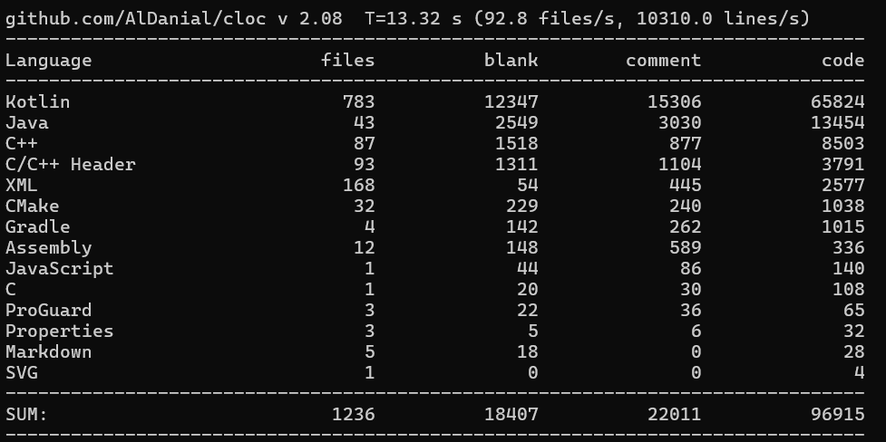
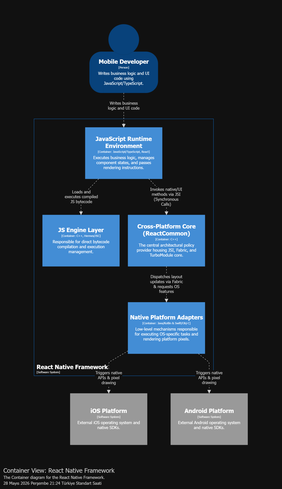

# Individual Project Journal: s328919 Oguzhan Akgun

## Activity Log
| Date | Activity Description | Effort (Hours) | Related Report Section |
| :--- | :--- | :--- | :--- |
|
| [2026-04-22](#log-2026-04-21) | Overview and ReactAndroid metric analysis | 2 | Overview |
| [2026-05-07](#log-2026-05-07) | Finalized Level 1 Context analysis and reporting | 3 | Level 1: Context |
| [2026-05-28](#log-2026-05-28) | Drafted alternative L2 configuration using Structurizr DSL | 4 | Level 2: Containers |

## Detailed Contributions
### [2026-04-19]
**Specific Contribution:** I explored the React Native repository to find a sub-system that meets the project's 100,000 lines of code requirement with ~97K lines of code. After reviewing the package structure, I identified ReactAndroid as the most optimal candidate for our analysis.

I performed a technical verification using the cloc tool to check the size of the component. The analysis confirmed that ReactAndroid contains approximately 97,000 lines of code. This size is ideal for a five-person team and fits the required project scope.

I prepared a formal suggestion and the necessary code statistics for the group meeting on April 23rd. I will propose that the team focuses on ReactAndroid for the upcoming design and architecture reports.

### [2026-05-07]
**Specific Contribution:** Conducted Level 1 System Context analysis for React Native using C4 notation.
* **Modeling:** Defined boundaries between 2 actors and 4 external systems.
**Theoretical Alignment:** Applied the "Separation of Policy and Detail" principle, identifying the framework as the core policy and SDKs as mechanisms.

### [2026-05-28]
**Specific Contribution:** Developed an alternative Level 2 Container configuration using Structurizr DSL to evaluate system boundaries and architectural decoupling as a proposal for the team review.

**Alternative Modeling:** Drafted an alternative C4 Container layout where the cross-platform C++ core (ReactCommon) is strictly isolated as an independent policy container, distinct from platform-dependent wrappers (Java/Swift). This was implemented to test the "Separation of Policy and Detail" layout.

**Proposal Readying:** Documented and exported the visual diagram to present it in the upcoming team meeting in order to evaluate the structural boundaries before settling on the final consolidated model.

