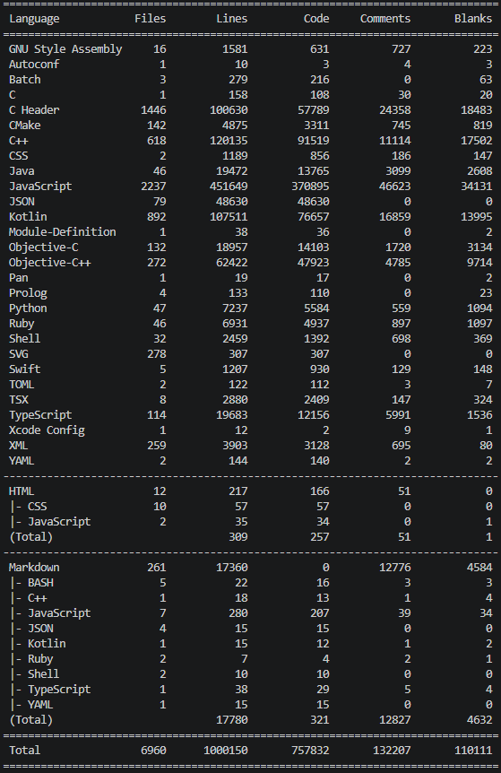

# Report 1: System Overview

# React Native

## System Purpose and Stakeholders
**Purpose:** To enable developers the building of  native mobile, web, and desktop applications using React and JavaScript/TypeScript, sharing a single codebase across multiple platforms.

**Main Stakeholders:** : 
1. **Mobile Application Developers** : The primary users who utilize the framework to build, test, and deploy applications.
2. **Code Maintainers** : Meta and community leads who maintain the systems architecture, ensure reliability and manage pull requests from third party contributors.

## System Description
**React Native** is a cross platform UI framework developed by Meta that enables developers to build production ready, natively rendering mobile applications for iOS and Android using a shared JavaScript and React codebase. 

By utilizing familiar web style development patterns and JSX markup, the system bridges the gap between web development and native execution without relying on HTML/CSS WebViews. Under the hood, a JavaScript runtime interprets the code and communicates with native platform threads via a C++ core architecture. 

The framework directly invokes platform APIs in Objective-C or Java. This architecture translates JavaScript logic into platform specific native UI primitives such as, iOS's `UIView` or Android's `ViewGroup` and grants direct access to hardware features like the camera or GPS. Ultimately, this allows developers to maintain a mostly unified codebase while delivering complex applications that look, feel, and perform exactly like traditional native software.

## Basic Code Statistics
**Number of Files:** : 6960 files 

**Lines of Code (LOC):** : 757832 

**Modules/Packages:** : Since this is a massive project, it is strucutred as a *Yarn Workspace monorepo*, not a single package, but a collection of packages modules that share a root set of dependencies. According to the root package.json, the modules are located in the **packages/*** and **private/*** directories. Dependencies are a lot to count manually as different modules have different dependencies based on their functionality.

**Number of Developers:** : 2821 Github contributors 

**Language/Tech Stack:** : Assembly, C, C++, HTML,CSS, JavaScript, TypeScript, Java, Kotlin, Objective-C , Objective-C++, Python, Ruby, Bash Scripts (Shell), Swift. 

