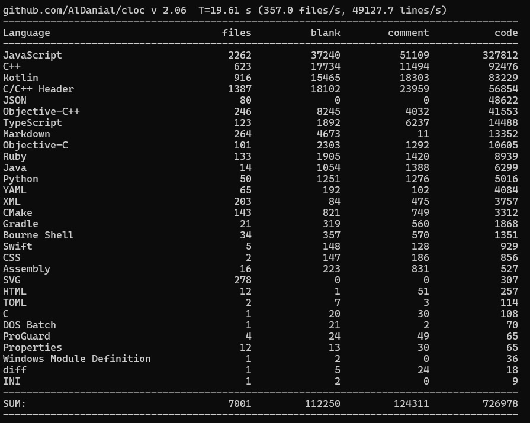

# System Overview: React Native

## 1. Purpose of the System and Main Stakeholders

**Purpose:**
React Native is an open-source UI software framework designed to enable the development of cross-platform applications (Android, iOS, macOS, Windows, and Web) using a single, unified JavaScript codebase. Its primary objective is to combine the declarative UI paradigm and component-based architecture of the React library with the performance and look-and-feel of native operating system capabilities. Unlike hybrid frameworks that render UIs inside a web view, React Native bridges JavaScript logic directly to native OS UI components (e.g., mapping a `<View>` in JavaScript to an `android.view.ViewGroup` on Android or a `UIView` on iOS). This architecture allows developers to achieve native-level performance and responsiveness while maintaining the rapid iteration cycles typical of web development.

With the introduction of the "New Architecture" (featuring the Fabric rendering engine and TurboModules), the framework's purpose has expanded to eliminate asynchronous serialization bottlenecks. By leveraging the JavaScript Interface (JSI), the system now allows synchronous, memory-shared communication between the JavaScript layer and the underlying C++ core, further optimizing UI rendering synchronization and native module execution.

**Main Stakeholders:**
* **Mobile Developers / Software Engineers:** The primary users of the framework. They utilize the React Native APIs, core components, and tooling to build, debug, and deploy cross-platform mobile applications without needing deep expertise in native languages like Kotlin or Swift.
* **Meta Platforms, Inc.:** The original creator, primary maintainer, and core sponsor of the project. Meta uses React Native extensively in its flagship applications (e.g., Facebook, Instagram) and drives the framework's architectural roadmap.
* **Open-Source Community & Contributors:** A vast ecosystem of independent developers and corporate entities (such as Microsoft and Shopify) who contribute bug fixes, architectural proposals, and third-party libraries that extend the framework's core capabilities.
* **End Users:** The individuals utilizing the mobile applications built with React Native. Their user experience—specifically regarding application responsiveness, native accessibility features, and smooth animations—is the ultimate benchmark of the framework's success.

## 2. System Description and Basic Code Statistics

**System Description:**
The React Native framework operates on a hybrid architecture that heavily relies on system-to-system integrations. It is conceptually divided into two main environments: the JavaScript runtime and the Native/C++ runtime. 

At the top level, developers write business logic and UI layouts using JavaScript and TypeScript within the **JS Framework Layer**. This layer uses the React library to manage state and compute changes in the component tree via its reconciliation process. 

These computed changes are passed down to the **Shared C++ Runtime Core** (the engine of the New Architecture). This core is platform-agnostic and relies on the Hermes JS Engine for bytecode execution and the Yoga Layout Engine for calculating flexbox-based geometries. The C++ core manages an immutable shadow tree of the UI and orchestrates layout commits synchronously. 

Finally, the generic layout instructions generated by the C++ core are passed to the **Platform Adapters** (React Android and React Apple). These adapters act as low-level translation boundaries, converting abstract C++ commands into concrete, OS-specific UI rendering methods via JNI (Java Native Interface) for Android and Objective-C++ bindings for iOS. This strict separation of concerns allows the framework's core rendering logic to remain entirely platform-independent.

**Basic Code Statistics:**
The following statistics represent the current state of the React Native repository, encompassing the core framework, platform adapters, and bundled utilities based on static code analysis.

* **Total Number of Files:** 7,001
* **Total Lines of Code (LOC):** 963,539 total lines, including 726,978 lines of executable source code.
* **Primary Programming Languages:** * JavaScript (327,812 LOC) & TypeScript (14,488 LOC): Dominant in the API and Framework layer.
    * C++ (92,476 LOC) & C/C++ Headers (56,854 LOC): Dominant in the Shared Runtime Core and JSI.
    * Kotlin (83,229 LOC) & Java (6,299 LOC): Dominant in the Android Platform Adapters.
    * Objective-C++ (41,553 LOC) & Objective-C (10,605 LOC): Dominant in the Apple Platform Adapters.

* **Main Modules / Packages:**
    * `Libraries/`: Contains the core JavaScript APIs and React Native npm package definitions.
    * `ReactCommon/`: Houses the cross-platform C++ core, including the Fabric rendering pipeline, TurboModules registry, and JSI definitions.
    * `ReactAndroid/`: Contains the Android-specific implementation, JNI adapters, and Kotlin/Java boundary code.
    * `React/` & `React-RCTAppDelegate/`: Contain the Apple-specific (iOS/macOS) implementations and Objective-C++ boundary code.
* **Number of Developers (Contributors):** 3,929 individual contributors to the main repository.