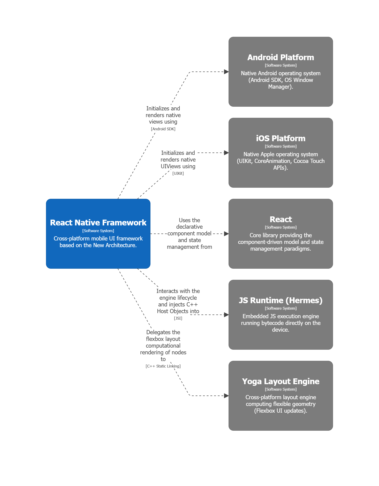
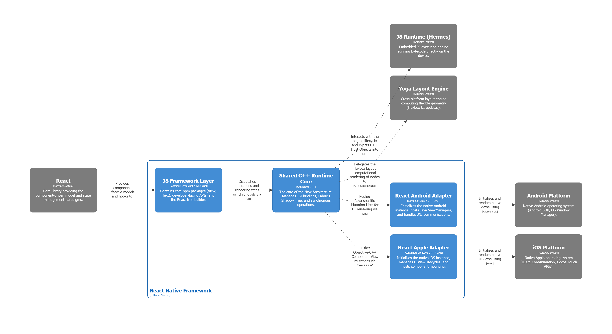
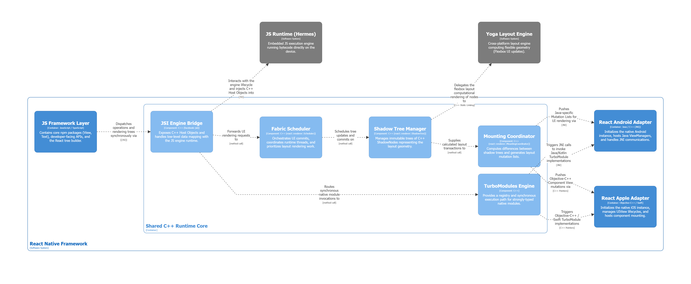

# Software Architecture Report

## Purpose
The purpose of this report is to describe the architecture of the React Native framework. It presents C4 diagrams produced with Structurizr (using a local workspace and the Structurizr DSL), followed by an analysis of React Native's compliance with the SOLID principles and a summary of its key architectural characteristics. In particular, this report analyzes the New Architecture based on Fabric, introduced with the release 0.76.

## L1 - System Context

### Diagram

### Explanation
The System Context diagram defines the high-level boundaries of the React Native Framework. The framework acts as an orchestrator between the JavaScript application and the native platform rendering components. 

The diagram highlights the main external systems with which React Native has to interact at runtime, such as the JavaScript runtime engine (which by default is Hermes, but can be changed by the developer), the specific OS APIs, and a layout engine (to which React Native delegates all the rendering calculations). 

Through these relationships, the framework is able to translate React's declarative and expressive logic into high-performance user interfaces, leveraging the native capabilities of each operating system without compromising the user experience. 

We did not include any person actor because React Native is a framework which resides between the user interface and the application logic and does not have a specific human user interacting with it directly.

## L2 - Containers

### Diagram

### Explanation
The Container diagram defines how responsibilities are splitted withing React Native during the application lifecycle and how those parts interacts. Since the monorepo is organized as a workspace of multiple packages, with the root package defining `packages/*` and `private/*` workspaces, we focused our analysis on the content of the public `/packages/react-native` folder.

Specifically, the `JS Framework Layer` container exposes the public API and lazily loads components and APIs such as `View`, `TextInput`, `FlatList`, and platform-specific helpers form `Libraries/`. 

The `Shared C++ Core` is the shared runtime and renderer layer. It coordinates shadow trees, mounting, delegates, animations, and event listeners, which make it the main orchestrator container for the new architecture. The `Shared C++ Core` is modeled from `React/` and `React Common/`.

The `React Android Adapter` and `React Apple Adapter` are platform containers, respectively from `ReactAndroid/` and `ReactApple/`, that adapt the shared core to native views, lifecycle, and platform-specific implementation details. On Android, the new architecture entry point enables Fabric, TurboModules, and bridgeless mode by default, which shows how the container acts as the platform bootstrapper. Since the purpose of those containers is only to adapt the core logic to the native implementation, we stopped our analysis at L2 for them.

### Relationship with Clean Architecture

There is a partial relationship with Clean Architecture, but React Native is not a clean-room example of it.

*   **The positive match:** The architecture uses inward-facing abstractions and outward-facing adapters. The C++ core defines delegate interfaces such as `UIManagerDelegate`, `UIManagerAnimationDelegate`, and `UIManagerViewTransitionDelegate`, while Android and iOS provide concrete implementations. This closely mirrors **Dependency Inversion**: the core depends on abstractions, and the platform containers plug in concrete behavior.
*   **The mismatch:** React Native is a framework, not an application domain. Framework concerns such as scheduling, mounting, layout, event dispatch, bridge compatibility, feature flags, and native module registration are all part of the same system. This means the layers are not as strictly separated as in classic Clean Architecture. The presence of legacy bridge code, global registries, and feature-flagged alternative execution paths makes the architecture pragmatic rather than pure.

In short, React Native resembles Clean Architecture in its use of adapters and abstractions, but it diverges because the framework itself must own platform integration and runtime orchestration.

## L3 - Components

### Diagram - C++ Core

### Explanation - C++ Core

The components diagram of the C++ Core highlights the new architecture mechanisms.

The `JSI Engine Bridge` represents the JavaScript Interface (JSI), which is a compact C++ API that bridges JavaScript engines and native code, enabling synchronous method calls between the JS layer and a C++ core. It exposes a runtime abstraction (`IRuntime`) for preparing and evaluating scripts, queuing and draining microtasks, and defining engine-specific runtime methods. Concrete implementations of those pure virtual APIs are provided by the underlying engine (Hermes, V8, JSC, etc.). 

JSI lets C++ create, inspect, and manipulate JS values (strings, numbers, symbols, objects, arrays, typed arrays) and supports host integration via `HostObject` and `HostFunction`, allowing JavaScript to get and set properties directly on native-backed objects.

### SOLID Discussion
React Native's New Architecture shifts heavily toward C++ to enforce decoupling and standard object-oriented design, showing alignments with the SOLID principles:

*   **Single Responsibility Principle (SRP):** The framework splits concerns rigidly across the new components. The `Fabric Scheduler` handles UI commit timing and thread prioritization; the `Shadow Tree Manager` calculates geometry via the Yoga Layout Engine; and the `Mounting Coordinator` calculates the difference trees (mutations) without worrying about *how* those views are painted on screen.
*   **Open/Closed Principle (OCP):** The framework is open to expansion through the `JSI Engine Bridge`. If a developer wants to switch the underlying JS engine from Hermes to V8, they do not need to rewrite the framework; they simply provide a different concrete implementation of JSI's virtual runtime class.
*   **Dependency Inversion Principle (DIP):** Low-level native OS platform views (`React Android Adapter` / `React Apple Adapter`) do not dictate the behavior of the high-level framework logic. Instead, both depend on the pure virtual interfaces and abstract structures defined in the `Shared C++ Runtime Core`.

## Architectural Characteristics

### Performance
Performance is one of the strongest architectural characteristics. React Native uses a shared C++ core, JSI, Yoga layout, and the Fabric renderer to reduce the overhead of the old bridge-based approach. The new architecture entry point on Android enables Fabric, TurboModules, and bridgeless mode by default, which shows that the system is actively optimized around lower-latency execution and tighter runtime integration

### Portability
Portability is a core quality goal. The public JS layer exposes the same component model across iOS and Android, while platform-specific containers provide the native adaptation. This lets most application code stay in JavaScript and reuse the same mental model on both platforms

### Interoperability
The shared C++ layer serves as a standard medium, allowing JavaScript and native platform modules (TurboModules) to seamlessly communicate with minimal data transformation overhead.

### Maintainability
Moving core framework logic into a unified C++ codebase allows the community to maintain a single source of truth for core layout features. Although, some component-level adapters are large and highly connected.

The result is a pragmatic architecture: good separation at the major container level, but intentionally dense adapter classes where the framework must translate between JS semantics and native platform behavior. That tradeoff is common in UI frameworks and is visible throughout React Native.

## Conclusion

React Native follows a layered, adapter-heavy architecture with a shared cross-platform core and platform-specific host runtimes. It aligns partially with Clean Architecture through abstraction boundaries and dependency inversion, but it does not strictly follow it because the framework itself owns runtime orchestration, platform integration, and compatibility layers. At component level, the clearest SOLID pressure is SRP in native manager classes and complex JS adapters.