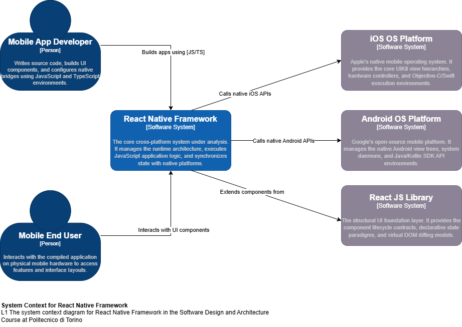
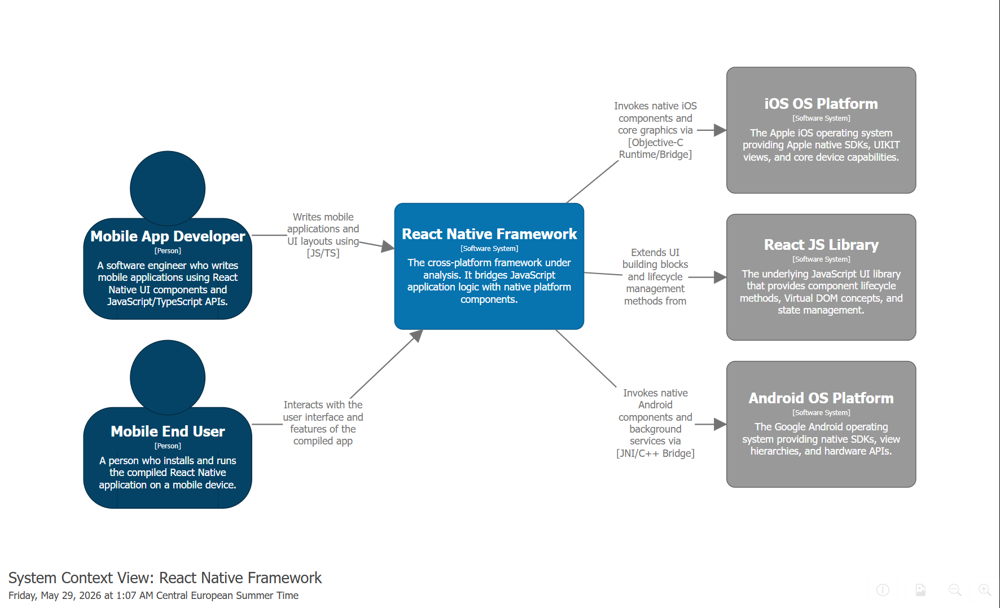
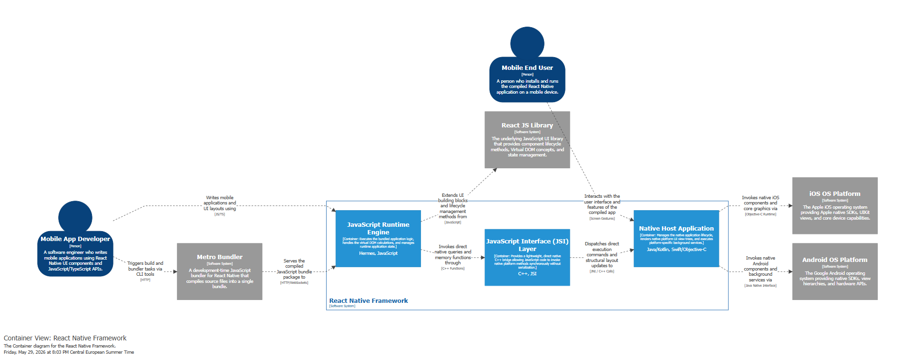
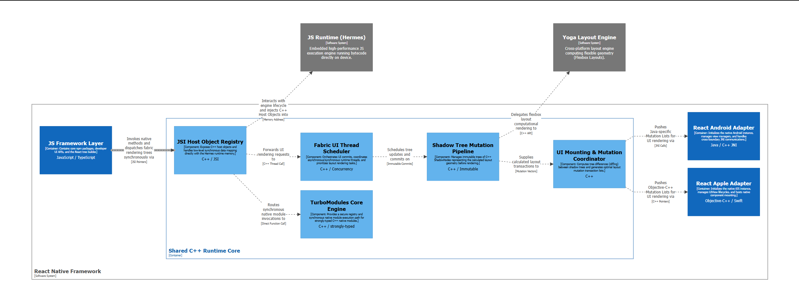

# Software Architecture Report

## L1 - System Context Diagram

The architecture of the system is modeled below using two distinct perspectives: a traditional visual representation for rapid iteration, and a text-based model using Structurizr DSL for version control and maintainability, following the guidelines on Page 24 of the course materials (visualization slide).

### Visual Model (Draw.io Version)

### Text-Based Model (Structurizr Version)

## L2 - Container Diagram

To analyze the internal technical boundaries of the framework, the system is broken down into its major runtime environments. This diagram details the technologies used and how data crosses boundaries between the JavaScript layer and the native operating systems.

### Text-Based Model (Structurizr Version)

- **JavaScript Runtime Engine (Hermes):** Executes the compiled JavaScript application logic and handles runtime state.
- **JavaScript Interface (JSI) Layer:** A lightweight C++ bridge allowing synchronous communication between JS and native platforms without serialization.
- **Native Host Application:** Manages the native application lifecycle and renders the actual platform UI view trees (Java/Kotlin for Android, Swift/Obj-C for iOS).

## L3 - Component Diagram (Shared C++ Runtime Core)

Focusing deeper into the architecture, the "Shared C++ Runtime Core" container is unpacked here to show its internal software components. This diagram illustrates how the modern React Native layout and module pipelines function under the hood.

### Text-Based Model (Structurizr Version)

- **JSI Host Object Registry:** Exposes C++ objects directly to the Hermes engine memory address space for synchronous access.
- **Fabric UI Thread Scheduler:** Coordinates runtime thread concurrency and prioritizes layout rendering tasks.
- **Shadow Tree Mutation Pipeline:** Manages immutable trees of C++ ShadowNodes that represent layout geometry before any UI updates are committed.
- **UI Mounting & Mutation Coordinator:** Computes differences (diffing) between shadow trees and sends calculated mutation vectors to the respective platform adapters (Android/Apple).
