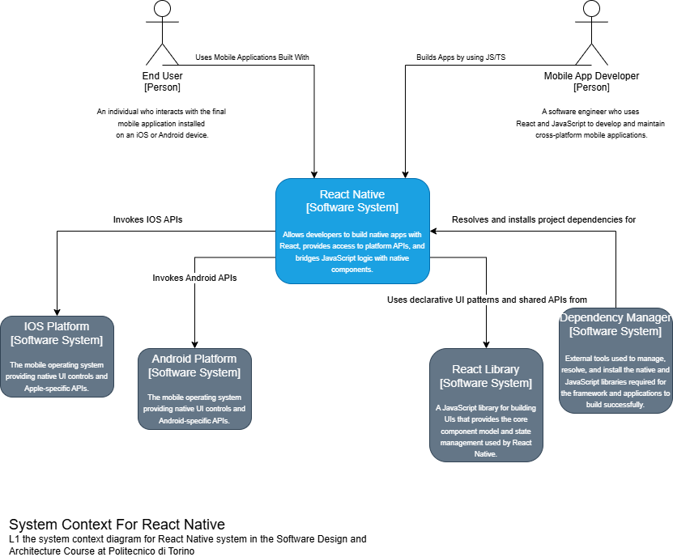

# React Native Architecture Analysis - Level 1 System Context

## 1. Information Reported - People
The following table defines the human actors interacting with the system:

| Name | Description |
| :--- | :--- |
| **Mobile App Developer** | A software engineer who utilizes the React Native framework to build cross-platform mobile applications. The developer interacts with the framework via JavaScript/TypeScript and manages build configurations through native dependency managers. |
| **End User** | An individual who interacts with the final mobile application on their physical device. From an architectural perspective, the user provides input to the application and receives visual feedback through the native UI components rendered by the framework. |

## 2. Information Reported - Software Systems
Definitions of the central system and its external environment:

| Name | Description |
| :--- | :--- |
| **React Native** | The central software system in scope. It acts as a high-level policy provider that bridges JavaScript business logic with platform-specific native mechanisms. |
| **iOS Platform** | An external software system providing the underlying Apple-specific native mechanisms, UI controls, and hardware-level APIs. [cite_start]It is considered a "detail" in the Clean Architecture model[cite: 34, 183]. |
| **Android Platform** | An external software system providing the underlying Google-specific native mechanisms, UI controls, and hardware-level APIs. [cite_start]Like the iOS platform, it is categorized as a "mechanism"[cite: 34, 50]. |
| **React Library** | An external UI library providing the core declarative component model and state management patterns. [cite_start]React Native's architectural policies are built upon these paradigms[cite: 50]. |
| **Dependency Managers** | Infrastructure systems (e.g., CocoaPods, NPM, Gradle) responsible for resolving, installing, and managing the various source code units and native dependencies required to build the framework and applications. |

