# Software Design Report
## 1. Dependencies

### 1.1 Software Modules
The analysis targets the internal architecture of the core React Native package (`packages/react-native/`), evaluating a total of 13 distinct sub-modules and directories. This includes core JavaScript logic (`Libraries`, `src`), build and tooling configurations (`scripts`, `gradle`), and platform-specific native directories (`ReactAndroid`, `ReactApple`, `ReactCommon`). Across these 13 modules, the structural integrity and coupling were assessed by mapping 14 internal JS/TS code dependencies and identifying 353 structural inconsistencies.

### 1.2 Methodology and Tools
To conduct a comprehensive dependency evaluation, a custom Node.js script (`analyze-dependencies.js`) was developed to extract both structural and historical metrics:
* **Code Dependencies (Static Analysis):** Structural dependencies were mapped by traversing all JavaScript and TypeScript source files (`.ts, .tsx, .js, .jsx`). The tool utilized regular expressions to extract static `import` and `require()` statements to identify internal cross-package dependencies.
* **Knowledge Dependencies (Co-change Analysis):** Logical coupling was evaluated by mining the Git version control history using the `git log` command to analyze the last 5,000 commits. The script calculated the frequency at which different packages and directories were modified together within the exact same commit.
* **Inconsistency Detection:** The script cross-referenced physical code imports against `package.json` declarations and Git co-change history to flag hidden coupling and undeclared dependencies.

### 1.3 Code Dependencies
*Evaluation of dependencies based on imports in the source code.*

**Code Dependencies Metrics Summary**

| Directory / Module | File Count | Outgoing Dependencies (Efferent) | Incoming Dependencies (Afferent) | Centrality Score |
| :--- | :--- | :--- | :--- | :--- |
| `Libraries` | 702 | 7 | 0 | 4.67 |
| `scripts` | 82 | 3 | 0 | 2.00 |
| `src` | 246 | 3 | 0 | 2.00 |
| `types` | 18 | 1 | 0 | 0.67 |
| `ReactAndroid`, `ReactApple`, `ReactCommon`, `gradle`, `flow` | Var. | 0 | 0 | 0.00 |

* **Highest Dependencies (Most efferent/afferent coupling):** * **Directories:** `Libraries` (7 Outgoing Dependencies, 702 files) and `scripts` (3 Outgoing Dependencies, 82 files).
  * **Reasoning:** The `Libraries` directory acts as the central hub and core repository for React Native's JavaScript components and APIs (yielding the highest Centrality score of 4.67). It is highly coupled because it acts as the orchestrator, pulling in utilities like `virtualized-lists`, `normalize-colors`, `fantom`, and `assets-registry` to construct the unified framework exposed to developers. 
* **Lowest Dependencies (Least coupling):** * **Directories:** `ReactAndroid`, `ReactApple`, `ReactCommon`, `gradle`, and `flow` (All register 0 Outgoing JS Dependencies).
  * **Reasoning:** These directories act as perfect "Leaf Nodes" in this specific analysis. Because they primarily contain native platform code (Java, Objective-C, C++) or build configurations rather than JavaScript/TypeScript source files, they do not participate in the JS module resolution tree. They represent the underlying native systems that the JS layer commands, rather than relying on JS utilities themselves.

### 1.4 Knowledge Dependencies
*Evaluation of dependencies based on co-change (how often two files/packages are changed together in the same Git commit).*

* **Analysis:** The co-change analysis of the Git history reveals massive logical coupling between the core `react-native` package and external monorepo tooling. The most frequent co-changes represent expected feature-evolution workflows spanning multiple system boundaries.

**Top Knowledge Dependencies & Hidden Coupling (Inconsistencies)**

| Package Pair | Co-change Frequency | Code Dependencies | Status |
| :--- | :--- | :--- | :--- |
| `react-native` ↔ `rn-tester` | 216 commits | 0 | Hidden Coupling |
| `react-native` ↔ `react-native-codegen` | 67 commits | 0 | Hidden Coupling |
| `react-native` ↔ `virtualized-lists` | 66 commits | 0 | Hidden Coupling |
| `react-native` ↔ `react-native-fantom` | 56 commits | 0 | Hidden Coupling |

* **Inconsistencies with Code Dependencies:** * **Identified Packages:** As shown in the table above, the most frequent co-changes lack direct structural code dependencies.
  * **Reasoning:** These inconsistencies represent "Hidden Coupling," where logical dependencies are driven by testing, architecture shifts, and feature parity rather than physical source code imports:
    * **Testing Synchronization:** The incredibly high co-change rate with `rn-tester` and `react-native-fantom` occurs because any update to a core UI component in `react-native` requires an immediate, parallel update to its corresponding test suite and internal testing applications to prevent CI pipeline failures.
    * **Code Generation:** `react-native-codegen` co-changes frequently with the core package because the New Architecture relies on generating C++ boilerplate from JS specifications. When a spec in the core framework changes, the code generator tooling must often be updated in tandem, creating strict logical coupling without direct file imports.

# Design Patterns

## 2.1 Pattern Instance 1: Observer Pattern (Event-Driven Communication)

**Link to Code:** [Libraries/vendor/emitter/EventEmitter.js](Libraries/vendor/emitter/EventEmitter.js)

### Roles

- **Subject (Observable)**: `EventEmitter<TEventToArgsMap>` class
  - Maintains internal registry of listeners
  - Provides `addListener()` method for observers to subscribe
  - Provides `emit()` method to notify all registered listeners
  - Provides `removeAllListeners()` to clean up subscriptions

- **Observer (Listener)**: Functions passed to `addListener()` with signature `(...args: TEventToArgsMap[TEvent]) => unknown`
  - React to events when `emit()` is called
  - Receive event data as function arguments
  - Can unsubscribe via returned `EventSubscription` object

- **Subscription**: `EventSubscription` interface
  - Contains `remove()` method for observers to unsubscribe
  - Manages lifecycle of individual listener registrations

- **Event Registry**: Private `#registry: Registry<TEventToArgsMap>` field
  - Maintains a Set of `Registration<TArgs>` objects per event type
  - Each registration stores listener, context, and remove function

### Rationale

**Problem Solved:**
- **Loose Coupling**: Components don't need direct references to communicate
- **Scalability**: Allows many-to-many communication patterns (multiple listeners, multiple events)
- **Asynchronous Communication**: Events can be emitted and handled asynchronously across the framework
- **Type Safety**: Generic type parameter `TEventToArgsMap` ensures compile-time type checking for event arguments

**Why Used in React Native:**
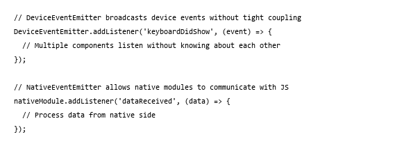

React Native is fundamentally a bridge between JavaScript and native platforms. Events are the primary communication mechanism because:
1. Native events (keyboard, network, sensors) are unpredictable
2. Multiple components may need to react to the same native event
3. Decoupling allows for easier testing and feature addition

### Alternatives

**Alternative 1: Direct Method Calls (Tight Coupling)**
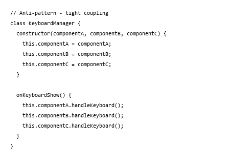

**Pros:**
- Simpler, more direct communication
- No overhead of listener registration

**Cons:**
- **Hard Coupling**: KeyboardManager depends on specific components
- **Inflexible**: Adding new listeners requires modifying KeyboardManager
- **Testing Nightmare**: Must mock all dependent components
- **Unmaintainable**: Changes ripple through codebase

---

**Alternative 2: Callbacks/Promise Chains**
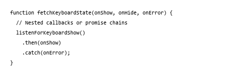

**Pros:**
- No external dependency system needed
- Can be traced linearly in code

**Cons:**
- **Callback Hell**: Multiple nested events become unreadable
- **No Cleanup**: Difficult to unsubscribe from events
- **Single Purpose**: Each callback handles one event type
- **Poor Reusability**: Cannot reuse same listener for multiple events

---

**Alternative 3: Reactive Streams (RxJS/Observables)**
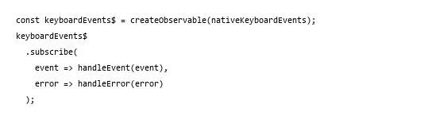

**Pros:**
- More powerful: Supports filtering, mapping, throttling
- Functional approach: Composable operators
- Standard library available (RxJS)

**Cons:**
- **Complexity Overhead**: Learning curve for RxJS operators
- **Bundle Size**: Adds ~50KB to bundle
- **Performance**: Wrapper around native events adds latency
- **Over-Engineering**: Simple events don't need reactive chains

---

**Why EventEmitter is Chosen:**

**-Minimal Overhead**: Pure JavaScript, no external dependencies

**-Type-Safe**: Built-in TypeScript/Flow support

**-Familiar**: Follows Node.js EventEmitter pattern

**-Efficient**: Direct callback invocation, no
transformation layers

**-Balanced**: Powerful enough for complex scenarios, simple for basic use

---

## 2.2 Pattern Instance 2: Registry Pattern (Component Lifecycle Management)

**Link to Code:** [Libraries/ReactNative/AppRegistry.js](Libraries/ReactNative/AppRegistry.js) and [Libraries/NativeComponent/NativeComponentRegistry.js](Libraries/NativeComponent/NativeComponentRegistry.js)

### Roles

- **Registry Manager**: `AppRegistry` object
  - Central registration point for all components
  - Stores component constructors with unique keys
  - Provides lookup mechanism via `runApplication()`
  - Provides `registerComponent()` and `setSurfaceProps()` methods

- **Registered Components**: React component constructors
  - Must be pure components or functional components
  - Stored as factory functions that return component instances
  - Example: `() => require('../LogBox/LogBoxInspectorContainer').default`

- **Registry Storage**: Internal data structure (map/object)
  - Maps component names (strings) to component factories (functions)
  - LazyCallableModule registry for modules
  - Enables deferred loading of component code

- **Global Reference**: `global.RN$AppRegistry`
  - Makes registry accessible throughout entire application
  - Acts as single source of truth for application structure

### Rationale

**Problem Solved:**
- **Central Discovery**: Single entry point for finding and instantiating components
- **Lazy Loading**: Components aren't loaded until explicitly requested via `runApplication()`
- **Dynamic Instantiation**: Components can be registered at runtime, not just at startup
- **Decoupling**: Main app doesn't import all components directly
- **Hot Reloading**: Can swap component implementations without restart

**Why Used in React Native:**
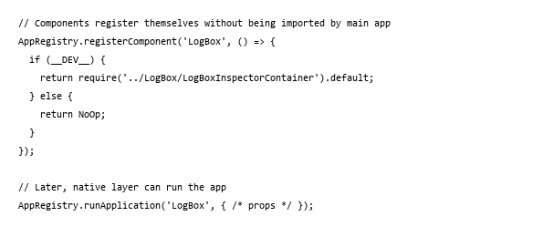

React Native's architecture requires:
1. **Bridge-First Startup**: Native layer controls when JS layer loads components
2. **Multiple Entry Points**: Different native activities/view controllers may load different root components
3. **Conditional Logic**: Development vs production components differ
4. **Module Loading**: Components should load on-demand, not all upfront

### Alternatives

**Alternative 1: Direct Imports (No Registry)**
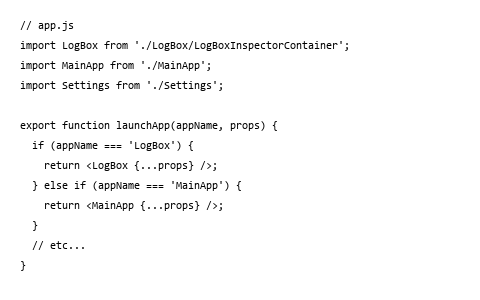

**Pros:**
- Simpler to understand for small projects
- Direct imports, no indirection
- Tree-shaking removes unused components

**Cons:**
- **Static Structure**: Cannot add components at runtime
- **Monolithic Bundle**: All components imported upfront, even if unused
- **Poor Scaling**: Adding new app means modifying this file
- **Testing Inflexible**: Hard to mock different component sets per test
- **Native Bridge Issues**: Difficult for native layer to independently choose components

---

**Alternative 2: File System Discovery (Auto-Registration)**
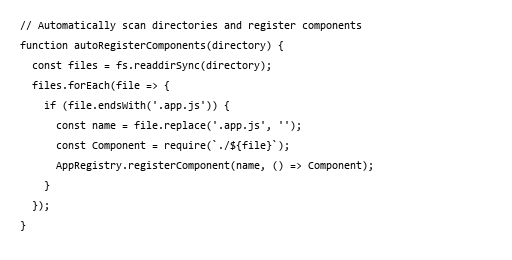

**Pros:**
- Highly Scalable: New apps don't require code changes
- Convention-Based: Reduces boilerplate registration code
- Flexible: Apps can live in any directory following convention

**Cons:**
- **Dynamic Code Loading**: Runtime string-based requires() are unpredictable
- **Bundle Analysis Fails**: Tree-shaking tools can't optimize dead code
- **Hard to Debug**: Component loading paths are implicit, not explicit
- **Complex Tooling**: Requires custom webpack/metro configuration
- **Not Portable**: Depends on file system, won't work in web/test environments

---

**Alternative 3: Dependency Injection Container**
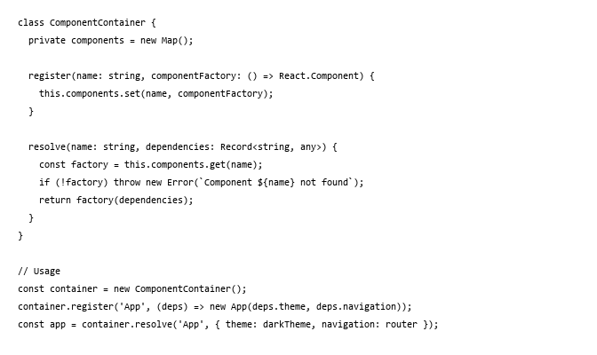

**Pros:**
- Powerful: Handles complex dependency graphs
- Testable: Easy to inject mock dependencies
- Type-Safe: Can be strongly typed
- Professional: Used in enterprise frameworks

**Cons:**
- **Over-Engineering**: Overkill for React Native's simpler needs
- **Performance Overhead**: Dependency resolution adds latency at startup
- **Learning Curve**: Requires understanding DI concepts
- **Bundle Size**: Adds ~20-30KB for a proper DI container
- **Not Native-Friendly**: Native layer can't easily interface with DI

---

**Why Registry Pattern is Chosen:**

**-Native Bridge Compatible**: String-based lookups work across native/JS boundary

**-Simple**: Straightforward map lookup, no complex resolution logic

**-Performance**: O(1) component lookup, minimal overhead

**-Dynamic**: Supports runtime registration for dev tools

**-Proven**: Works reliably across billions of React Native apps

---

## 2.3 Pattern Instance 3: Factory Pattern (Flexible Animation Creation)

**Link to Code:** [Libraries/Animated/AnimatedImplementation.js](Libraries/Animated/AnimatedImplementation.js)

### Roles

- **Factory Functions**: `addImpl()`, `subtractImpl()`, `divideImpl()`, `multiplyImpl()`, etc.
  - Accept parameters defining the animation operation
  - Return concrete animation node instances without exposing constructors
  - Encapsulate instantiation logic

- **Concrete Products**: `AnimatedAddition`, `AnimatedSubtraction`, `AnimatedDivision`, `AnimatedMultiplication`, `AnimatedModulo`, `AnimatedDiffClamp`
  - Each implements specific mathematical operation on animated values
  - All inherit from common `AnimatedNode` base class
  - Hidden from client code behind factory functions

- **Animation Configurations**: Objects like `TimingAnimationConfig`, `SpringAnimationConfig`, `DecayAnimationConfig`
  - Define behavior of different animation types
  - Passed to factory functions to customize animation creation

- **Client Code**: Application developers
  - Use public API functions: `Animated.add()`, `Animated.multiply()`, etc.
  - Don't directly instantiate `AnimatedAddition` or other classes
  - See only factory function interface, not implementation

### Rationale

**Problem Solved:**
- **Abstraction**: Hides internal animation node hierarchy from users
- **Extensibility**: New animation types can be added without changing public API
- **Consistency**: All animation nodes created through same pattern
- **Flexibility**: Can change implementation without breaking client code
- **Type Safety**: Return types are specific to each factory (TypeScript/Flow benefits)

**Why Used in React Native:**

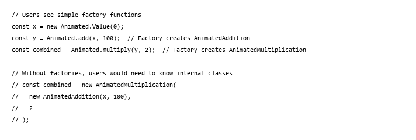

Animation system needs factories because:
1. **Operation Types Vary**: Addition, subtraction, multiplication require different implementations
2. **Nested Compositions**: Operations can be nested arbitrarily deep
3. **Future Extensions**: New operations (sqrt, sin, cos) may be added later
4. **User-Friendly API**: `Animated.add()` is clearer than `new AnimatedAddition()`

### Alternatives

**Alternative 1: Direct Class Instantiation**

**Pros:**
- Most Direct: No abstraction layer
- Maximum Control: Users see exact classes being created
- Slightly Faster: One less function call

**Cons:**
- **API Leakage**: Internal classes become public API surface
- **Hard to Refactor**: Renaming/restructuring classes breaks user code
- **No Validation**: No chance to validate inputs before instantiation
- **Complex**: Users must know about all animation node types
- **Brittles**: Adding new variations requires new classes and user education

---

**Alternative 2: Builder Pattern**
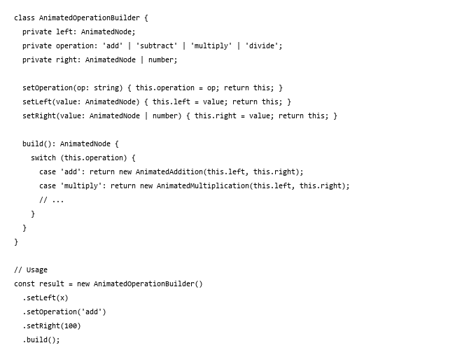

**Pros:**
- Flexible: Can set many optional parameters
- Chainable: Fluent interface reads naturally
- Validation: Can validate all params in `build()`

**Cons:**
- **Over-Engineering**: Overkill for simple operations
- **Verbose**: Requires 4 lines instead of 1
- **Performance**: Creates intermediate builder object
- **Harder to Read**: Less obvious than `Animated.add(x, 100)`
- **Not Functional**: Breaks React's immutable patterns

---

**Alternative 3: Static Factory Methods (Class Methods)**
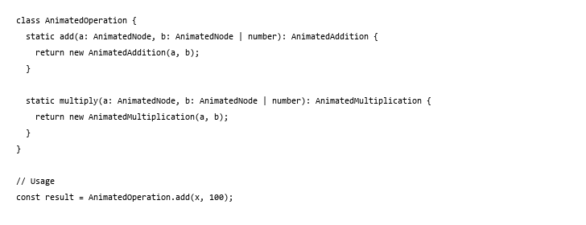

**Pros:**
- Organized: Groups related factories in one place
- Namespace: Prevents polluting global scope
- Class-Based: Feels more structured

**Cons:**
- **Verbose Naming**: Users must type `AnimatedOperation.add()` instead of `Animated.add()`
- **Module Import**: Requires importing `AnimatedOperation` class
- **Less Functional**: Doesn't fit React/JavaScript functional paradigms
- **API Surface**: More to document and maintain

---

**Why Factory Functions are Chosen:**

**-Simplicity**: One-line API for users: `Animated.add(x, 100)`

**-Functional**: Aligns with JavaScript functional programming style

**-Minimal**: No extra boilerplate or builder objects

**-Namespace**: Organized under `Animated` namespace via exports

**-Tree-Shakeable**: Unused factories can be eliminated in production builds

---

## 2.4 Pattern Instance 4: Composite Pattern (Tree-Based Animation Composition)

**Link to Code:** [Libraries/Animated/nodes/AnimatedWithChildren.js](Libraries/Animated/nodes/AnimatedWithChildren.js)

### Roles

- **Component (Base)**: `AnimatedNode` abstract base class
  - Defines interface for all animation nodes
  - Methods: `__makeNative()`, `__attach()`, `__detach()`, `__callListeners()`
  - Can represent both leaf nodes and composite nodes

- **Leaf Nodes**: `AnimatedValue`, `AnimatedInterpolation`, `AnimatedColor`
  - Don't have children
  - Represent final animation values
  - Examples: simple values, interpolations, color transformations

- **Composite Nodes**: `AnimatedWithChildren` (base for composites)
  - Subclasses: `AnimatedAddition`, `AnimatedMultiplication`, etc.
  - Contain array of child `AnimatedNode` instances: `_children: Array<AnimatedNode> = []`
  - Delegate operations to children via `__getChildren()`

- **Operations**: Methods that work uniformly on nodes and composites
  - `__addChild()`: Registers child, calls `__attach()` when first child added
  - `__removeChild()`: Deregisters child, calls `__detach()` when last child removed
  - `__makeNative()`: Recursively converts entire tree to native animation
  - `__callListeners()`: Propagates value changes down tree

### Rationale

**Problem Solved:**
- **Recursive Composition**: Animations can be arbitrarily nested: `add(value, multiply(other, 2))`
- **Unified Interface**: Client code treats individual values and complex expressions identically
- **Tree Operations**: Operations like native conversion, listener notification work recursively
- **Natural Hierarchy**: Reflects mathematical expression structure
- **Scalability**: New node types don't require special composite handling logic

**Why Used in React Native:**

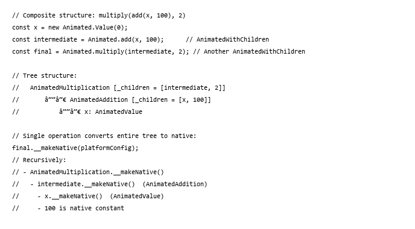

Composite pattern is essential because:
1. **Mathematical Expressions**: Animations inherently nest (e.g., `sin(x * 2 + 1)`)
2. **Reusability**: Intermediate animations can be reused in multiple places
3. **Platform Optimization**: Entire expression tree sent to native layer at once
4. **Performance**: Native execution of complex expressions is orders of magnitude faster

### Alternatives

**Alternative 1: Flattening All Operations**
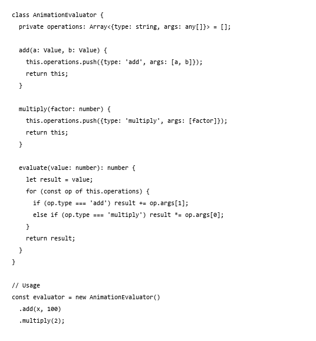

**Pros:**
- Simpler Implementation: Flat list, no tree navigation
- Clear Order: Operations execute in registration order
- Easier to Debug: Can log each operation step

**Cons:**
- **Lost Structure**: Can't express nested compositions
- **Code Duplication**: `add(x, multiply(y, 2))` and `multiply(add(x, y), 2)` both require same flattening
- **Not Composable**: Can't reuse intermediate results
- **No Optimization**: Can't optimize shared subexpressions
- **Not Extensible**: Adding new operation types requires modifying evaluator

---

**Alternative 2: Direct Native Translation (No JS Tree)**

**Pros:**
- Most Efficient: Bypasses JS tree overhead
- Minimal Memory: No intermediate JS objects

**Cons:**
- **Limited Debugging**: Can't inspect animation state in JS
- **Hard to Compose**: String-based expressions are fragile
- **Poor Error Handling**: Syntax errors detected only at native layer
- **No Type Safety**: Strings lose TypeScript/Flow checking
- **Complex Parser**: Native layer must parse expression strings
- **Not Reusable**: Can't use intermediate expressions in JS code

---

**Alternative 3: Callback Chain (Imperative Animation)**
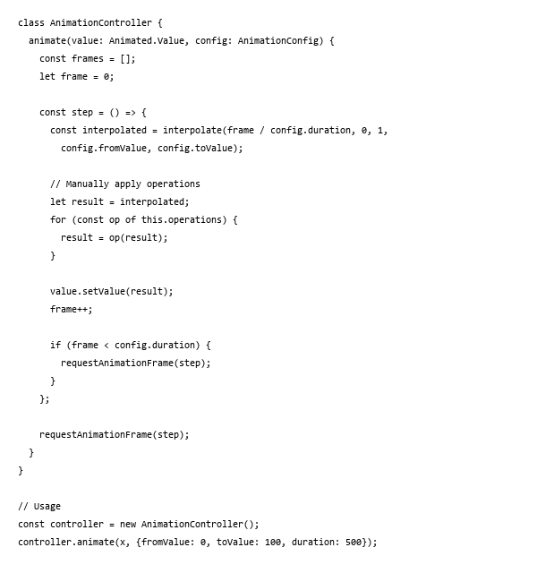

**Pros:**
- Complete Control: Frame-by-frame control of animation
- Flexible: Can apply arbitrary JS logic

**Cons:**
- **Performance: 60fps* 0.5s = 30 callbacks/second, major JS execution overhead
- **CPU Intensive**: Cannot run on native thread
- **Battery Drain**: Continuous JavaScript execution
- **Janky**: Dropped frames when JS thread busy
- **Complex**: Requires manual frame scheduling
- **Not Declarative**: Imperative style doesn't fit React patterns

---

**Why Composite Pattern is Chosen:**

**-Expressive**: Natural representation of mathematical compositions

**-Native Optimized**: Entire tree sent to native for efficient execution

**-Reusable**: Intermediate nodes can be used in multiple animations

**-Performant**: Native execution avoids JS overhead

**-Extensible**: New node types integrate seamlessly into tree

**-Type-Safe**: Each node type clearly defined with TypeScript/Flow

---

## 3. Summary

*Provide a comprehensive summary of the findings from the two design aspects analyzed above. Synthesize what the dependency structures and pattern usages tell you about the overall software design quality, modularity, and maintainability of the system.*

